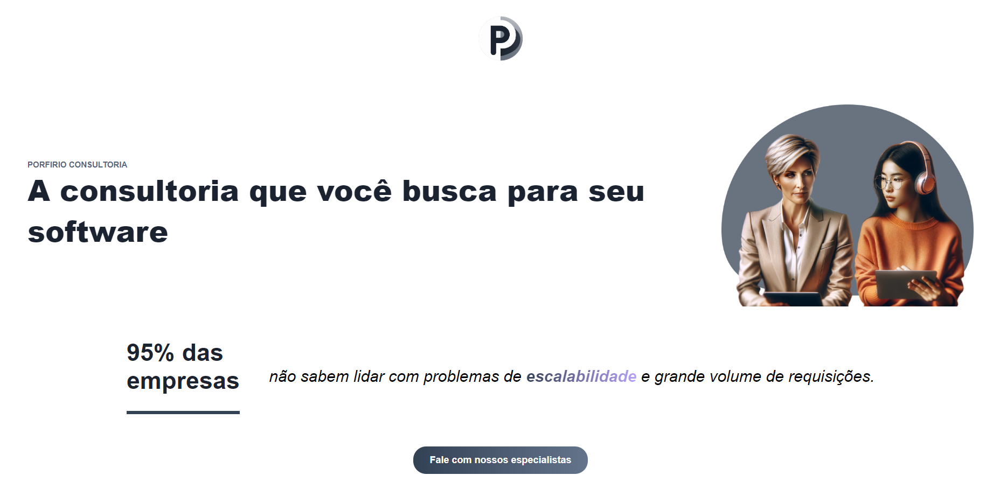

# Angular 17 Landing Page

Welcome to the Angular 17 Landing Page project, designed to showcase the latest features of Angular 17, including the new control flow, signals, standalone components, and services.

## Project Structure

- **home.component.ts**: This file contains the implementation of the `HomeComponent`, the main component responsible for displaying the landing page content. The `HomeComponent` is an Angular 17 component that utilizes the latest features, such as the new control flow, to enhance user interactions.

- **newsletter-form.component.ts**: The `NewsletterFormComponent` is an Angular component that demonstrates the use of standalone components and services. It utilizes signals for asynchronous operations and a service (`NewsletterService`) for communication with an AWS API.

- **newsletter.service.ts**: The `NewsletterService` is an Angular service responsible for sending newsletter subscription data to an AWS API using HTTP requests.

## Project Running



## How to Use

1. Clone the repository to your local machine.
2. Open the project in your preferred Angular 17 development environment.
3. Explore and modify the code to understand the implementation of new features.
4. Run the application using the Angular CLI command: `ng serve`.
5. Open your browser and navigate to `http://localhost:4200/` to experience the Angular 17 landing page.

## Getting Started


1. **Install Angular CLI**: If you haven't installed the Angular CLI, you can do so by running the following command in your terminal:

   ```bash
     npm install -g @angular/cli
    ```

2. **Install Dependencies**: Navigate to the project directory and install the project dependencies:

    ```bash
      npm install
    ```

3. **Run the Application**: Use the Angular CLI to run the application locally:

    ```bash
      ng serve
    ```

4. **Explore and Learn**: Review the code in each file to understand how Angular 17 features are implemented, including the new control flow, signals, standalone components, and services.

## Additional Notes

- Ensure that your AWS API is properly configured for the newsletter service to work.

- Feel free to experiment with the code, make changes, and enhance the functionality as part of your exploration of Angular 17 features
